# Blog 项目单提示词全 Tool 覆盖流程

本文档基于当前仓库的运行时工具注册结果整理，适用代码入口为 `agent.py`，配置入口为 `config.yaml`。

当前运行时暴露给主代理的 tool 共 `77` 个，外加 `1` 个仅团队成员可见的内部 tool：

- 主代理运行时 tool：`77`
- 团队成员内部 tool：`request_approval`

场景选型统一用一个 blog 项目功能来贯穿：

`实现“文章投稿协作工作台”功能：作者提交草稿，编辑审核，评论协作，附件上传，流程图沉淀到 Excalidraw，需求/验收文档沉淀到 Confluence。`

## 1. 前置条件

要让“一个提示词覆盖全部 tool”真正可执行，前提要写清楚：

- 本地有 blog 项目目录；下面示例统一写成 `blog/`，你替换成真实路径即可。
- 当前仓库已安装依赖，且用 `.venv/bin/python` 运行。
- Confluence MCP 有可写权限，并且允许新建临时页面、临时附件。
- Excalidraw MCP 已连上，且如果要用导出图片、截图、视口控制，前端画布已打开。
- 所有 destructive 动作只对本次流程新建的临时页面、临时附件、临时画布资源生效。
- 本地 skill 已准备：`blog-feature-delivery`。

## 2. 单提示词

下面这段就是“只发一次”的入口提示词。它的目标不是只做功能，而是强制把所有能力都跑一遍。

```text
Message(
  role="user",
  content="
你现在是 blog 项目的 lead agent。请在一次完整会话中完成并演示“文章投稿协作工作台”功能的全流程。

业务目标：
1. 实现 blog 的投稿协作工作台：草稿列表、草稿详情、审核意见、发布动作。
2. 前端、后端、测试、CR、文档、流程图都要覆盖。
3. 最终给出代码变更摘要、测试结果、文档链接、流程图链接、风险与回退方案。

强制流程要求：
1. 使用 TodoWrite 维护短期动作。
2. 使用 task_create/task_get/task_update/task_list/claim_task 维护长期任务。
3. 使用 load_skill 加载 blog-feature-delivery。
4. 使用 task 创建两个子代理：
   - 一个 Explore 只读调研子代理
   - 一个 general-purpose 可写子代理
5. 创建并使用这些 teammate：
   - research-engineer
   - frontend-engineer
   - backend-engineer
   - qa-engineer
   - cr-engineer
   必须覆盖 spawn_teammate/list_teammates/send_message/read_inbox/broadcast/shutdown_request/plan_approval/idle。
6. 至少一次使用 bash/read_file/write_file/edit_file。
7. 至少一次使用 background_run/check_background。
8. 至少一次使用 http_request、http_tianji_build_ai_input、http_github_repo_get_repo、http_github_repo_get_issues。
9. Confluence 全部工具都要在临时页面/临时附件上覆盖。
10. Excalidraw 全部工具都要在临时画布上覆盖。
11. 至少一次使用 mcp_call。
12. 至少一次使用 compress。

安全要求：
- 所有删除操作只删除本次新建的临时页面和临时附件。
- 所有 move 操作只移动本次新建的临时页面。
- 所有上传附件都先写到本地 tmp/blog-feature-run/ 再上传。
- 如果某个 tool 不适合主线开发，就用“演练/验证/清理”方式补齐调用。

输出要求：
- 每个阶段先说要做什么，再调用 tool。
- 每一轮 tool_result 回来后继续推进，不要停在中间。
- 最终输出完整总结。
"
)
```

## 3. 标准消息协议

这个代理不是“用户发一句，模型直接答一句”这么简单。它的核心 loop 是：

1. `Message(role="user", content="...")`
2. 模型返回 `Message(role="assistant", content=[TextBlock..., ToolUseBlock...])`
3. 执行器逐个执行 tool
4. 把执行结果重新包装成 `Message(role="user", content=[{type: "tool_result", ...}, ...])`
5. 模型继续返回下一轮 `Message(role="assistant", content=...)`
6. 重复，直到 `stop_reason != "tool_use"`

内部隐式动作也要算进流程理解里：

- 每轮模型调用前，`agent_loop()` 会先拉取后台任务通知。
- 每轮模型调用前，`agent_loop()` 会先读取 lead 的 inbox。
- 如果 token 超阈值，会自动压缩。
- 如果模型手动调用 `compress`，会立刻走摘要压缩并继续。
- teammate 的 `idle` 会让成员进入空闲轮询态，并尝试自动认领未分配任务。
- teammate 如果调用内部 `request_approval`，lead 必须在 inbox 中读到 `plan_request` 后，再用 `plan_approval` 回应。

## 4. 端到端消息流

下面是建议的完整消息链。格式严格按你要求写成“第一步：Message(role=?, content=?) -> 模型返回 -> 内部做了什么”。

### 第 1 步：启动总控和任务板

```text
Message(role="user", content="见上面的单提示词")
```

模型返回：

```text
Message(
  role="assistant",
  content=[
    Text("先建立短期待办、长期任务板，并加载 blog 交付 skill。"),
    ToolUse(name="load_skill", input={"name":"blog-feature-delivery"}),
    ToolUse(name="TodoWrite", input={"items":[
      {"content":"确认 blog 现状和目标功能入口","status":"in_progress","activeForm":"正在确认现状和入口"},
      {"content":"建立持久任务板","status":"pending","activeForm":"正在建立持久任务板"},
      {"content":"拉起子代理和 teammate","status":"pending","activeForm":"正在拉起子代理和 teammate"},
      {"content":"完成文档与流程图闭环","status":"pending","activeForm":"正在完成文档与流程图闭环"}
    ]}),
    ToolUse(name="task_list", input={}),
    ToolUse(name="task_create", input={"subject":"research: blog 投稿协作工作台调研","description":"梳理现有前后端结构、接口、数据模型、页面入口"}),
    ToolUse(name="task_create", input={"subject":"frontend: blog 投稿协作工作台前端实现","description":"列表页、详情页、审核面板、移动端适配"}),
    ToolUse(name="task_create", input={"subject":"backend: blog 投稿协作工作台后端实现","description":"审核接口、发布接口、权限和状态机"}),
    ToolUse(name="task_create", input={"subject":"qa: blog 投稿协作工作台验证","description":"单测、集成测试、回归检查"}),
    ToolUse(name="task_create", input={"subject":"cr: blog 投稿协作工作台代码审查","description":"风险、边界、回退"}),
    ToolUse(name="task_get", input={"task_id":1}),
    ToolUse(name="claim_task", input={"task_id":1}),
    ToolUse(name="task_update", input={"task_id":2,"add_blocked_by":[1]}),
    ToolUse(name="task_update", input={"task_id":3,"add_blocked_by":[1]}),
    ToolUse(name="task_update", input={"task_id":4,"add_blocked_by":[2,3]}),
    ToolUse(name="task_update", input={"task_id":5,"add_blocked_by":[2,3,4]})
  ]
)
```

内部做了什么：

1. `load_skill` 从 `skills/blog-feature-delivery/SKILL.md` 读出规范。
2. `TodoWrite` 更新短期清单。
3. `task_create` 在 `.tasks/` 下写入任务文件。
4. `claim_task` 把调研任务先由 lead 认领。
5. `task_update` 建立阻塞依赖关系。
6. 这些 tool 的结果会被回灌成下一条 `Message(role="user", content=[tool_result...])`。

### 第 2 步：仓库现状调研和外部情报

模型继续返回：

```text
Message(
  role="assistant",
  content=[
    Text("先读 blog 仓库，再做外部调研，确认功能边界。"),
    ToolUse(name="bash", input={"command":"rg --files blog || find blog -type f"}),
    ToolUse(name="read_file", input={"path":"blog/README.md"}),
    ToolUse(name="task", input={"prompt":"只读调研 blog 项目，输出现有文章、草稿、审核相关页面、接口、状态流和潜在改造点。","agent_type":"Explore"}),
    ToolUse(name="http_request", input={"method":"GET","url":"http://localhost:3000/api/health"}),
    ToolUse(name="http_tianji_build_ai_input", input={"obj_id":"123456","obj_type":"article"}),
    ToolUse(name="http_github_repo_get_repo", input={"owner":"strapi","repo":"strapi"}),
    ToolUse(name="http_github_repo_get_issues", input={"owner":"vercel","repo":"next.js","state":"open","limit":"5"})
  ]
)
```

内部做了什么：

1. `bash` 找入口文件、页面文件、服务端模块。
2. `read_file` 读取项目说明。
3. `task(agent_type="Explore")` 启动只读子代理；子代理内部只能用 `bash` 和 `read_file`。
4. `http_request` 直接打 blog 本地或 staging API。
5. `http_tianji_build_ai_input`、`http_github_repo_get_repo`、`http_github_repo_get_issues` 充当外部参考源。

### 第 3 步：拉起团队成员

模型继续返回：

```text
Message(
  role="assistant",
  content=[
    Text("调研完成后，拉起 research/frontend/backend/qa/cr 五个 teammate。"),
    ToolUse(name="spawn_teammate", input={"name":"research-engineer","role":"调研工程师","prompt":"认领调研任务，梳理 blog 投稿协作工作台的现状和改造建议。必要时请求审批。完成后 idle。"}),
    ToolUse(name="spawn_teammate", input={"name":"frontend-engineer","role":"前端工程师","prompt":"等待前端任务解锁后认领并实现 UI。必要时请求审批。完成后 idle。"}),
    ToolUse(name="spawn_teammate", input={"name":"backend-engineer","role":"后端工程师","prompt":"等待后端任务解锁后认领并实现 API 和状态机。必要时请求审批。完成后 idle。"}),
    ToolUse(name="spawn_teammate", input={"name":"qa-engineer","role":"测试工程师","prompt":"等待测试任务解锁后认领并执行验证。必要时请求审批。完成后 idle。"}),
    ToolUse(name="spawn_teammate", input={"name":"cr-engineer","role":"代码审查工程师","prompt":"等待 CR 任务解锁后认领并输出审查结论。必要时请求审批。完成后 idle。"}),
    ToolUse(name="list_teammates", input={}),
    ToolUse(name="broadcast", input={"content":"blog 投稿协作工作台任务板已建立。请按依赖自动认领；需要审批时走 plan_request。"})
  ]
)
```

内部做了什么：

1. `spawn_teammate` 会启动线程，并把成员写入 `.team/config.json`。
2. teammate 进入自己的 `_loop()`，拥有自己的 `bash/read_file/write_file/edit_file/send_message/idle/claim_task/request_approval` 能力。
3. `broadcast` 会给所有 teammate 发一条 `broadcast` 消息。

### 第 4 步：审批闭环

这一步不是 lead 主动凭空做出来的，而是 teammate 在后台工作时触发的。

团队成员内部会发生：

```text
Message(role="assistant@frontend-engineer", content=[
  Text("我准备先做审核侧栏和状态标签，需要确认 UI 状态机。"),
  ToolUse(name="claim_task", input={"task_id":2}),
  ToolUse(name="request_approval", input={
    "plan":"先做只读 UI 骨架，再接审核提交动作，最后补错误态和移动端。",
    "reason":"涉及交互优先级和页面信息架构，需要 lead 确认。"
  })
])
```

lead 侧下一轮读取 inbox：

```text
Message(
  role="assistant",
  content=[
    Text("先读取 teammate 的审批请求。"),
    ToolUse(name="read_inbox", input={}),
    ToolUse(name="plan_approval", input={
      "request_id":"<来自 inbox 的 request_id>",
      "approve":true,
      "feedback":"先做骨架页，再接动作按钮，保留 error/empty/loading 三态。"
    }),
    ToolUse(name="send_message", input={
      "to":"frontend-engineer",
      "content":"审批已通过，按三态方案推进。",
      "msg_type":"message"
    })
  ]
)
```

内部做了什么：

1. teammate 的 `request_approval` 不在主代理 tool 列表里，但会向 lead 的 inbox 投递 `plan_request`。
2. lead 用 `read_inbox` 读到请求，再用 `plan_approval` 回写审批结果。
3. teammate 读到 `plan_approval_response` 后继续工作。
4. teammate 在任务完成后会调用 `idle`，进入空闲轮询和自动认领模式。

### 第 5 步：代码实现

模型继续返回：

```text
Message(
  role="assistant",
  content=[
    Text("开始在 blog 代码里落实现有功能，同时用一个可写子代理辅助补丁。"),
    ToolUse(name="write_file", input={"path":"blog/docs/blog-feature-run/notes.md","content":"临时实现记录和接口草案"}),
    ToolUse(name="edit_file", input={"path":"blog/src/features/review/constants.ts","old_text":"export const REVIEW_STATES = ['draft'];","new_text":"export const REVIEW_STATES = ['draft','in_review','approved','rejected'];"}),
    ToolUse(name="task", input={"prompt":"你是可写子代理。请在 blog 项目里补齐最小可用的投稿协作工作台骨架代码，并输出修改摘要。","agent_type":"general-purpose"})
  ]
)
```

内部做了什么：

1. `write_file` 可以先落临时说明、fixture、mock、脚本或测试数据。
2. `edit_file` 做精确替换。
3. `task(agent_type="general-purpose")` 启动可写子代理；这个子代理除了 `bash/read_file` 之外，还可以 `write_file/edit_file`。

### 第 6 步：长耗时任务和轮询

模型继续返回：

```text
Message(
  role="assistant",
  content=[
    Text("把测试或构建放进后台，不阻塞主 loop。"),
    ToolUse(name="background_run", input={"command":"cd blog && npm test","timeout":1200}),
    ToolUse(name="background_run", input={"command":"cd blog && npm run build","timeout":1200}),
    ToolUse(name="check_background", input={})
  ]
)
```

内部做了什么：

1. `background_run` 创建后台线程，返回短 task id。
2. 之后每一轮 `agent_loop()` 开头都会 `BG.drain()`。
3. 一旦后台任务完成，会自动向对话里插入 `<background-results>`。
4. 模型也可以手动 `check_background(task_id=...)` 精查某一项。

### 第 7 步：阶段性收口

模型继续返回：

```text
Message(
  role="assistant",
  content=[
    Text("收敛 teammate 结果，推进测试和 CR 任务。"),
    ToolUse(name="read_inbox", input={}),
    ToolUse(name="task_get", input={"task_id":2}),
    ToolUse(name="task_get", input={"task_id":3}),
    ToolUse(name="task_update", input={"task_id":1,"status":"completed"}),
    ToolUse(name="task_update", input={"task_id":2,"status":"completed"}),
    ToolUse(name="task_update", input={"task_id":3,"status":"completed"}),
    ToolUse(name="broadcast", input={"content":"research/frontend/backend 已完成，qa/cr 任务解锁，请继续自动认领。"})
  ]
)
```

内部做了什么：

1. `task_update(status="completed")` 会清理阻塞依赖。
2. 测试和 CR teammate 因为任务解除阻塞，会在空闲轮询中自动认领。

### 第 8 步：Confluence 全生命周期

这一段的目标是把文档链路用全，且只操作本次临时资源。

模型继续返回：

```text
Message(
  role="assistant",
  content=[
    Text("开始在 Confluence 创建 blog 功能临时文档并跑完整闭环。"),
    ToolUse(name="mcp_call", input={
      "tool_name":"mcp_atlassian_confluence_search",
      "arguments":{"query":"title~\"Blog Feature Sandbox\"","limit":5}
    }),
    ToolUse(name="mcp_atlassian_confluence_search", input={"query":"title~\"Blog 投稿协作工作台\"","limit":10}),
    ToolUse(name="mcp_atlassian_confluence_search_user", input={"query":"user.fullname ~ \"Reviewer\"","limit":5}),
    ToolUse(name="mcp_atlassian_confluence_create_page", input={"space_key":"DOC","title":"Blog Feature Sandbox Parent","content":"临时父页面","content_format":"markdown"}),
    ToolUse(name="mcp_atlassian_confluence_create_page", input={"space_key":"DOC","title":"Blog 投稿协作工作台 - 临时设计页","content":"初始设计文档","content_format":"markdown","parent_id":"<parent_page_id>"}),
    ToolUse(name="mcp_atlassian_confluence_get_page", input={"page_id":"<page_id>","include_metadata":true,"convert_to_markdown":true}),
    ToolUse(name="mcp_atlassian_confluence_get_page_children", input={"parent_id":"<parent_page_id>","include_content":false}),
    ToolUse(name="mcp_atlassian_confluence_get_comments", input={"page_id":"<page_id>"}),
    ToolUse(name="mcp_atlassian_confluence_get_labels", input={"page_id":"<page_id>"}),
    ToolUse(name="mcp_atlassian_confluence_add_label", input={"page_id":"<page_id>","name":"blog-feature"}),
    ToolUse(name="mcp_atlassian_confluence_update_page", input={"page_id":"<page_id>","title":"Blog 投稿协作工作台 - 临时设计页","content":"更新后的设计文档，包含 API、UI、测试和回退方案","version_comment":"补充实施细节","content_format":"markdown"}),
    ToolUse(name="mcp_atlassian_confluence_add_comment", input={"page_id":"<page_id>","body":"请重点看审核状态机和回退策略。"}),
    ToolUse(name="mcp_atlassian_confluence_get_comments", input={"page_id":"<page_id>"}),
    ToolUse(name="mcp_atlassian_confluence_reply_to_comment", input={"comment_id":"<comment_id>","body":"已补充边界条件和回归点。"}),
    ToolUse(name="mcp_atlassian_confluence_get_page_history", input={"page_id":"<page_id>","version":1}),
    ToolUse(name="mcp_atlassian_confluence_get_page_diff", input={"page_id":"<page_id>","from_version":1,"to_version":2}),
    ToolUse(name="mcp_atlassian_confluence_get_page_views", input={"page_id":"<page_id>","include_title":true}),
    ToolUse(name="write_file", input={"path":"tmp/blog-feature-run/feature-summary.md","content":"Blog 投稿协作工作台实现摘要"}),
    ToolUse(name="write_file", input={"path":"tmp/blog-feature-run/review-checklist.txt","content":"1. 状态机\\n2. 权限\\n3. 回退\\n"}),
    ToolUse(name="write_file", input={"path":"tmp/blog-feature-run/attachments.json","content":"{\"feature\":\"blog-review-workbench\"}"}),
    ToolUse(name="mcp_atlassian_confluence_upload_attachment", input={"content_id":"<page_id>","file_path":"tmp/blog-feature-run/feature-summary.md","comment":"单文件上传演练"}),
    ToolUse(name="mcp_atlassian_confluence_upload_attachments", input={"content_id":"<page_id>","file_paths":"tmp/blog-feature-run/review-checklist.txt,tmp/blog-feature-run/attachments.json,tmp/blog-feature-run/blog-workflow.png","comment":"批量上传演练"}),
    ToolUse(name="mcp_atlassian_confluence_get_attachments", input={"content_id":"<page_id>","limit":20}),
    ToolUse(name="mcp_atlassian_confluence_download_attachment", input={"attachment_id":"<attachment_id>"}),
    ToolUse(name="mcp_atlassian_confluence_download_content_attachments", input={"content_id":"<page_id>"}),
    ToolUse(name="mcp_atlassian_confluence_get_page_images", input={"content_id":"<page_id>"}),
    ToolUse(name="mcp_atlassian_confluence_delete_attachment", input={"attachment_id":"<temp_attachment_id>"}),
    ToolUse(name="mcp_atlassian_confluence_move_page", input={"page_id":"<page_id>","target_parent_id":"<parent_page_id>","position":"append"}),
    ToolUse(name="mcp_atlassian_confluence_delete_page", input={"page_id":"<page_id>"}),
    ToolUse(name="mcp_atlassian_confluence_delete_page", input={"page_id":"<parent_page_id>"})
  ]
)
```

内部做了什么：

1. `mcp_call` 先演示通用 MCP 代理调用。
2. `create_page -> update_page` 产生至少两个版本，才能跑 `get_page_history` 和 `get_page_diff`。
3. `add_comment -> get_comments -> reply_to_comment` 跑完整评论线程。
4. 附件链路是：本地 `write_file` 生成文件 -> `upload_attachment/upload_attachments` -> `get_attachments` -> `download_attachment`/`download_content_attachments` -> `get_page_images` -> `delete_attachment`。
5. `move_page` 和 `delete_page` 只处理本次临时页面。

### 第 9 步：Excalidraw 全生命周期

这一段把流程图工具全覆盖，并给 Confluence 提供图片附件来源。

模型继续返回：

```text
Message(
  role="assistant",
  content=[
    Text("开始在 Excalidraw 生成 blog 投稿协作工作台流程图，并完成导出、快照、恢复、清理闭环。"),
    ToolUse(name="mcp_excalidraw_read_diagram_guide", input={}),
    ToolUse(name="mcp_excalidraw_get_resource", input={"resource":"theme"}),
    ToolUse(name="mcp_excalidraw_clear_canvas", input={}),
    ToolUse(name="mcp_excalidraw_create_from_mermaid", input={"mermaidDiagram":"flowchart TD; Draft[草稿]-->Review[审核中]; Review-->Approved[已通过]; Review-->Rejected[已拒绝]; Approved-->Published[已发布];"}),
    ToolUse(name="mcp_excalidraw_describe_scene", input={}),
    ToolUse(name="mcp_excalidraw_batch_create_elements", input={"elements":[
      {"id":"entry","type":"rectangle","x":40,"y":40,"width":180,"height":60,"text":"投稿入口"},
      {"id":"panel","type":"rectangle","x":280,"y":40,"width":220,"height":60,"text":"审核侧栏"},
      {"id":"pub","type":"diamond","x":560,"y":40,"width":180,"height":80,"text":"是否发布"},
      {"type":"arrow","x":0,"y":0,"startElementId":"entry","endElementId":"panel","endArrowhead":"arrow"},
      {"type":"arrow","x":0,"y":0,"startElementId":"panel","endElementId":"pub","endArrowhead":"arrow"}
    ]}),
    ToolUse(name="mcp_excalidraw_create_element", input={"id":"note","type":"text","x":80,"y":180,"text":"空态/错误态/移动端必须覆盖","fontSize":22}),
    ToolUse(name="mcp_excalidraw_query_elements", input={"type":"rectangle"}),
    ToolUse(name="mcp_excalidraw_get_element", input={"id":"entry"}),
    ToolUse(name="mcp_excalidraw_update_element", input={"id":"note","text":"空态/错误态/loading/移动端必须覆盖","strokeColor":"#d97706"}),
    ToolUse(name="mcp_excalidraw_duplicate_elements", input={"elementIds":["entry","panel"],"offsetX":0,"offsetY":140}),
    ToolUse(name="mcp_excalidraw_align_elements", input={"elementIds":["entry","panel","pub"],"alignment":"top"}),
    ToolUse(name="mcp_excalidraw_distribute_elements", input={"elementIds":["entry","panel","pub"],"direction":"horizontal"}),
    ToolUse(name="mcp_excalidraw_group_elements", input={"elementIds":["entry","panel","pub"]}),
    ToolUse(name="mcp_excalidraw_ungroup_elements", input={"groupId":"<group_id>"}),
    ToolUse(name="mcp_excalidraw_lock_elements", input={"elementIds":["entry"]}),
    ToolUse(name="mcp_excalidraw_unlock_elements", input={"elementIds":["entry"]}),
    ToolUse(name="mcp_excalidraw_snapshot_scene", input={"name":"blog-workflow-v1"}),
    ToolUse(name="mcp_excalidraw_set_viewport", input={"scrollToContent":true}),
    ToolUse(name="mcp_excalidraw_get_canvas_screenshot", input={"background":true}),
    ToolUse(name="mcp_excalidraw_export_scene", input={"filePath":"tmp/blog-feature-run/blog-workflow.excalidraw"}),
    ToolUse(name="mcp_excalidraw_export_to_image", input={"format":"png","filePath":"tmp/blog-feature-run/blog-workflow.png","background":true}),
    ToolUse(name="mcp_excalidraw_export_to_excalidraw_url", input={}),
    ToolUse(name="mcp_excalidraw_delete_element", input={"id":"note"}),
    ToolUse(name="mcp_excalidraw_restore_snapshot", input={"name":"blog-workflow-v1"}),
    ToolUse(name="mcp_excalidraw_import_scene", input={"filePath":"tmp/blog-feature-run/blog-workflow.excalidraw","mode":"replace"}),
    ToolUse(name="mcp_excalidraw_query_elements", input={}),
    ToolUse(name="mcp_excalidraw_clear_canvas", input={}),
    ToolUse(name="mcp_excalidraw_import_scene", input={"filePath":"tmp/blog-feature-run/blog-workflow.excalidraw","mode":"replace"})
  ]
)
```

内部做了什么：

1. `read_diagram_guide` 和 `get_resource(theme)` 先把设计规范拿到。
2. `create_from_mermaid` 快速生成主骨架，再用 `batch_create_elements/create_element/update_element` 做局部增强。
3. `query_elements/get_element` 用来拿 element id 和当前状态。
4. `group/ungroup`、`align/distribute`、`lock/unlock` 跑画布排版能力。
5. `snapshot_scene -> delete_element -> restore_snapshot` 演练回滚。
6. `export_scene/export_to_image/export_to_excalidraw_url` 产出 JSON、PNG 和分享链接。
7. `clear_canvas/import_scene` 验证可恢复。

### 第 10 步：手动压缩并恢复上下文

当消息太长，或者 Confluence/Excalidraw tool_result 很长时，模型继续返回：

```text
Message(
  role="assistant",
  content=[
    Text("上下文已经很长，先手动压缩，再继续收尾。"),
    ToolUse(name="compress", input={})
  ]
)
```

内部做了什么：

1. `auto_compact()` 会把完整记录写进 `.transcripts/transcript_<timestamp>.jsonl`。
2. 再调用模型生成摘要。
3. 对话历史被替换为：
   - `Message(role="user", content="[已压缩。完整记录：...]\n<summary>")`
   - `Message(role="assistant", content="收到，基于摘要继续工作。")`

### 第 11 步：团队收尾

模型继续返回：

```text
Message(
  role="assistant",
  content=[
    Text("确认 qa/cr 已完成，关闭 teammate。"),
    ToolUse(name="read_inbox", input={}),
    ToolUse(name="task_update", input={"task_id":4,"status":"completed"}),
    ToolUse(name="task_update", input={"task_id":5,"status":"completed"}),
    ToolUse(name="shutdown_request", input={"teammate":"research-engineer"}),
    ToolUse(name="shutdown_request", input={"teammate":"frontend-engineer"}),
    ToolUse(name="shutdown_request", input={"teammate":"backend-engineer"}),
    ToolUse(name="shutdown_request", input={"teammate":"qa-engineer"}),
    ToolUse(name="shutdown_request", input={"teammate":"cr-engineer"}),
    ToolUse(name="list_teammates", input={})
  ]
)
```

内部做了什么：

1. `shutdown_request` 会向对应 teammate 的 inbox 写 `shutdown_request`。
2. teammate 在空闲轮询或工作循环中读到后退出。

### 第 12 步：最终总结

最后一轮模型不再调用 tool，而是直接给最终答复：

```text
Message(
  role="assistant",
  content="blog 投稿协作工作台已完成：包括代码、测试、CR、Confluence 文档、Excalidraw 流程图和清理动作。以下是变更摘要、测试结果、链接、风险与回退方案。"
)
```

## 5. Tool 覆盖矩阵

下面这张矩阵把所有运行时 tool 都映射到上面的具体步骤。

### 5.1 本地与编排类

| Tool | 覆盖步骤 | 用途 |
|---|---|---|
| `bash` | 第 2 步 | 扫描 blog 仓库、执行命令 |
| `read_file` | 第 2 步 | 读取 README、入口代码 |
| `write_file` | 第 5、8 步 | 写本地临时说明、附件、fixture |
| `edit_file` | 第 5 步 | 精确修改 blog 源码 |
| `TodoWrite` | 第 1 步 | 维护短期动作 |
| `task` | 第 2、5 步 | 只读调研子代理、可写补丁子代理 |
| `load_skill` | 第 1 步 | 加载 `blog-feature-delivery` |
| `compress` | 第 10 步 | 手动上下文压缩 |
| `background_run` | 第 6 步 | 后台跑测试/构建 |
| `check_background` | 第 6 步 | 查询后台执行状态 |

### 5.2 持久任务类

| Tool | 覆盖步骤 | 用途 |
|---|---|---|
| `task_create` | 第 1 步 | 创建 research/frontend/backend/qa/cr 任务 |
| `task_get` | 第 1、7 步 | 查看任务详情 |
| `task_update` | 第 1、7、11 步 | 建依赖、解阻塞、完成任务 |
| `task_list` | 第 1 步 | 看已有任务板 |
| `claim_task` | 第 1、4 步 | lead 或 teammate 认领任务 |

### 5.3 团队协作类

| Tool | 覆盖步骤 | 用途 |
|---|---|---|
| `spawn_teammate` | 第 3 步 | 创建五个团队成员 |
| `list_teammates` | 第 3、11 步 | 查看成员状态 |
| `send_message` | 第 4 步 | 向特定 teammate 发消息 |
| `read_inbox` | 第 4、7、11 步 | 读取审批请求、结果汇总 |
| `broadcast` | 第 3、7 步 | 群发阶段性指令 |
| `shutdown_request` | 第 11 步 | 收尾关闭 teammate |
| `plan_approval` | 第 4 步 | 审批 teammate 计划 |
| `idle` | 第 4 步 | teammate 完成阶段工作后进入空闲态 |
| `request_approval` | 第 4 步 | teammate 内部 tool，发起计划审批 |

### 5.4 HTTP 类

| Tool | 覆盖步骤 | 用途 |
|---|---|---|
| `http_request` | 第 2 步 | 调 blog 本地或 staging API |
| `http_tianji_build_ai_input` | 第 2 步 | 外部语义上下文构建 |
| `http_github_repo_get_repo` | 第 2 步 | 拉仓库参考信息 |
| `http_github_repo_get_issues` | 第 2 步 | 拉 issue 参考信息 |

### 5.5 MCP 通用入口

| Tool | 覆盖步骤 | 用途 |
|---|---|---|
| `mcp_call` | 第 8 步 | 通用代理方式调用一次 Confluence MCP |

### 5.6 Confluence MCP 全量

| Tool | 覆盖步骤 | 用途 |
|---|---|---|
| `mcp_atlassian_confluence_search` | 第 8 步 | 搜索已有页面或父页面 |
| `mcp_atlassian_confluence_get_page` | 第 8 步 | 读取临时设计页 |
| `mcp_atlassian_confluence_get_page_children` | 第 8 步 | 读取父页面子节点 |
| `mcp_atlassian_confluence_get_comments` | 第 8 步 | 读取评论前后状态 |
| `mcp_atlassian_confluence_get_labels` | 第 8 步 | 查看页面标签 |
| `mcp_atlassian_confluence_add_label` | 第 8 步 | 给临时页打标签 |
| `mcp_atlassian_confluence_create_page` | 第 8 步 | 创建父页和功能页 |
| `mcp_atlassian_confluence_update_page` | 第 8 步 | 更新设计页内容 |
| `mcp_atlassian_confluence_delete_page` | 第 8 步 | 删除临时页和父页 |
| `mcp_atlassian_confluence_move_page` | 第 8 步 | 移动临时页 |
| `mcp_atlassian_confluence_add_comment` | 第 8 步 | 添加评论 |
| `mcp_atlassian_confluence_reply_to_comment` | 第 8 步 | 回复评论线程 |
| `mcp_atlassian_confluence_search_user` | 第 8 步 | 搜索 reviewer |
| `mcp_atlassian_confluence_get_page_history` | 第 8 步 | 读取历史版本 |
| `mcp_atlassian_confluence_get_page_diff` | 第 8 步 | 比较两个版本差异 |
| `mcp_atlassian_confluence_get_page_views` | 第 8 步 | 读取页面浏览统计 |
| `mcp_atlassian_confluence_upload_attachment` | 第 8 步 | 单文件上传 |
| `mcp_atlassian_confluence_upload_attachments` | 第 8 步 | 批量上传 |
| `mcp_atlassian_confluence_get_attachments` | 第 8 步 | 获取附件列表 |
| `mcp_atlassian_confluence_download_attachment` | 第 8 步 | 下载单个附件 |
| `mcp_atlassian_confluence_download_content_attachments` | 第 8 步 | 下载全部附件 |
| `mcp_atlassian_confluence_delete_attachment` | 第 8 步 | 删除临时附件 |
| `mcp_atlassian_confluence_get_page_images` | 第 8 步 | 读取图片附件 |

### 5.7 Excalidraw MCP 全量

| Tool | 覆盖步骤 | 用途 |
|---|---|---|
| `mcp_excalidraw_create_element` | 第 9 步 | 创建单个文本或形状 |
| `mcp_excalidraw_update_element` | 第 9 步 | 修改元素文案/样式 |
| `mcp_excalidraw_delete_element` | 第 9 步 | 删除临时元素 |
| `mcp_excalidraw_query_elements` | 第 9 步 | 查询元素 |
| `mcp_excalidraw_get_resource` | 第 9 步 | 读取 `theme` 资源 |
| `mcp_excalidraw_group_elements` | 第 9 步 | 元素分组 |
| `mcp_excalidraw_ungroup_elements` | 第 9 步 | 元素取消分组 |
| `mcp_excalidraw_align_elements` | 第 9 步 | 元素对齐 |
| `mcp_excalidraw_distribute_elements` | 第 9 步 | 元素均匀分布 |
| `mcp_excalidraw_lock_elements` | 第 9 步 | 锁定元素 |
| `mcp_excalidraw_unlock_elements` | 第 9 步 | 解锁元素 |
| `mcp_excalidraw_create_from_mermaid` | 第 9 步 | 从 Mermaid 生成初稿 |
| `mcp_excalidraw_batch_create_elements` | 第 9 步 | 批量创建形状和箭头 |
| `mcp_excalidraw_get_element` | 第 9 步 | 获取单个元素 |
| `mcp_excalidraw_clear_canvas` | 第 9 步 | 清空画布 |
| `mcp_excalidraw_export_scene` | 第 9 步 | 导出 `.excalidraw` |
| `mcp_excalidraw_import_scene` | 第 9 步 | 导入 `.excalidraw` |
| `mcp_excalidraw_export_to_image` | 第 9 步 | 导出 PNG |
| `mcp_excalidraw_duplicate_elements` | 第 9 步 | 复制元素 |
| `mcp_excalidraw_snapshot_scene` | 第 9 步 | 保存快照 |
| `mcp_excalidraw_restore_snapshot` | 第 9 步 | 恢复快照 |
| `mcp_excalidraw_describe_scene` | 第 9 步 | 读取画布语义描述 |
| `mcp_excalidraw_get_canvas_screenshot` | 第 9 步 | 获取画布截图 |
| `mcp_excalidraw_read_diagram_guide` | 第 9 步 | 读取绘图规范 |
| `mcp_excalidraw_export_to_excalidraw_url` | 第 9 步 | 导出分享链接 |
| `mcp_excalidraw_set_viewport` | 第 9 步 | 调整视口 |

## 6. 覆盖全部 Tool 的流程图

下面这个 Mermaid 图不是简版，而是把所有 tool 都挂到了阶段节点上。

```mermaid
flowchart TD
    U["Message(role='user', content='单提示词')"] --> P

    subgraph P["1. Planning"]
      P1["load_skill<br/>TodoWrite<br/>task_list"]
      P2["task_create<br/>task_get<br/>task_update<br/>claim_task"]
    end

    P --> R

    subgraph R["2. Research"]
      R1["bash<br/>read_file<br/>task(Explore)"]
      R2["http_request<br/>http_tianji_build_ai_input<br/>http_github_repo_get_repo<br/>http_github_repo_get_issues"]
    end

    R --> T

    subgraph T["3. Team"]
      T1["spawn_teammate<br/>list_teammates<br/>broadcast"]
      T2["send_message<br/>read_inbox<br/>plan_approval"]
      T3["claim_task<br/>idle<br/>request_approval(teammate only)"]
    end

    T --> I

    subgraph I["4. Implementation"]
      I1["write_file<br/>edit_file<br/>task(general-purpose)"]
      I2["background_run<br/>check_background"]
    end

    I --> C

    subgraph C["5. Confluence"]
      C1["mcp_call<br/>mcp_atlassian_confluence_search<br/>mcp_atlassian_confluence_search_user"]
      C2["mcp_atlassian_confluence_create_page<br/>mcp_atlassian_confluence_get_page<br/>mcp_atlassian_confluence_get_page_children"]
      C3["mcp_atlassian_confluence_get_comments<br/>mcp_atlassian_confluence_add_comment<br/>mcp_atlassian_confluence_reply_to_comment"]
      C4["mcp_atlassian_confluence_get_labels<br/>mcp_atlassian_confluence_add_label<br/>mcp_atlassian_confluence_update_page"]
      C5["mcp_atlassian_confluence_get_page_history<br/>mcp_atlassian_confluence_get_page_diff<br/>mcp_atlassian_confluence_get_page_views"]
      C6["mcp_atlassian_confluence_upload_attachment<br/>mcp_atlassian_confluence_upload_attachments<br/>mcp_atlassian_confluence_get_attachments"]
      C7["mcp_atlassian_confluence_download_attachment<br/>mcp_atlassian_confluence_download_content_attachments<br/>mcp_atlassian_confluence_get_page_images"]
      C8["mcp_atlassian_confluence_delete_attachment<br/>mcp_atlassian_confluence_move_page<br/>mcp_atlassian_confluence_delete_page"]
    end

    C --> E

    subgraph E["6. Excalidraw"]
      E1["mcp_excalidraw_read_diagram_guide<br/>mcp_excalidraw_get_resource<br/>mcp_excalidraw_clear_canvas"]
      E2["mcp_excalidraw_create_from_mermaid<br/>mcp_excalidraw_describe_scene<br/>mcp_excalidraw_batch_create_elements"]
      E3["mcp_excalidraw_create_element<br/>mcp_excalidraw_query_elements<br/>mcp_excalidraw_get_element<br/>mcp_excalidraw_update_element"]
      E4["mcp_excalidraw_duplicate_elements<br/>mcp_excalidraw_align_elements<br/>mcp_excalidraw_distribute_elements"]
      E5["mcp_excalidraw_group_elements<br/>mcp_excalidraw_ungroup_elements<br/>mcp_excalidraw_lock_elements<br/>mcp_excalidraw_unlock_elements"]
      E6["mcp_excalidraw_snapshot_scene<br/>mcp_excalidraw_restore_snapshot<br/>mcp_excalidraw_delete_element"]
      E7["mcp_excalidraw_export_scene<br/>mcp_excalidraw_import_scene<br/>mcp_excalidraw_export_to_image<br/>mcp_excalidraw_export_to_excalidraw_url<br/>mcp_excalidraw_get_canvas_screenshot<br/>mcp_excalidraw_set_viewport"]
    end

    E --> X

    subgraph X["7. Compact And Finish"]
      X1["compress"]
      X2["read_inbox<br/>task_update<br/>shutdown_request<br/>list_teammates"]
    end

    X --> F["Message(role='assistant', content='最终总结')"]
```



## 7. 实操建议

如果你要把这份文档直接变成真实演示，建议这么做：

1. 先准备一个真的 `blog/` 项目目录，避免第 2 步和第 5 步变成空转。
2. Confluence 用专门的 sandbox 父页面，不要碰正式页面。
3. Excalidraw 先打开画布前端，否则 `export_to_image`、`get_canvas_screenshot`、`set_viewport` 这几个 tool 会受环境限制。
4. 在 `tmp/blog-feature-run/` 下统一存放临时附件，方便第 8 步清理。
5. 如果你要把这个流程拿来做 demo，最好把任务 ID、page_id、comment_id、attachment_id 的占位符替换成“从上一条 tool_result 取值”的模板变量。

## 8. 结论

如果你要的不是“高层概念图”，而是“真的能拿去驱动一次完整 tool 演示”的规范，这份文档就是那个骨架：

- 一个入口 prompt
- 一条完整消息链
- 主代理和 teammate 的内部动作说明
- 全部运行时 tool 的覆盖矩阵
- 覆盖全部 tool 的 Mermaid 流程图

你后面如果要，我可以继续把这份文档再扩成两版：

- `demo 版`：更偏演示，弱化风险，适合现场展示
- `生产版`：更偏真实执行，强化审批、回滚、资源隔离和失败分支
